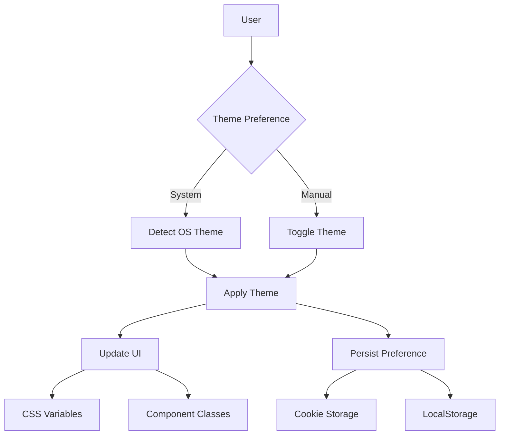
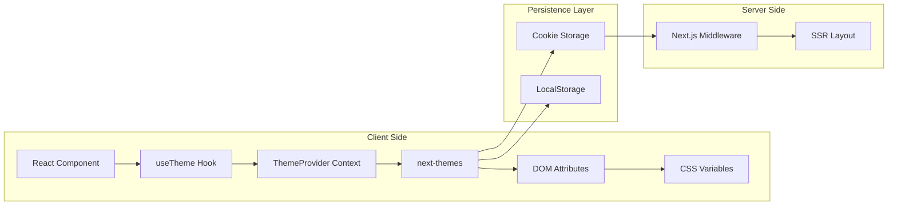
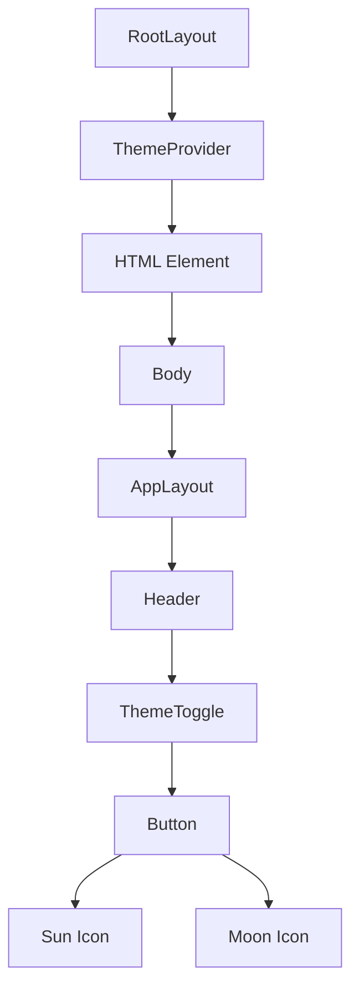
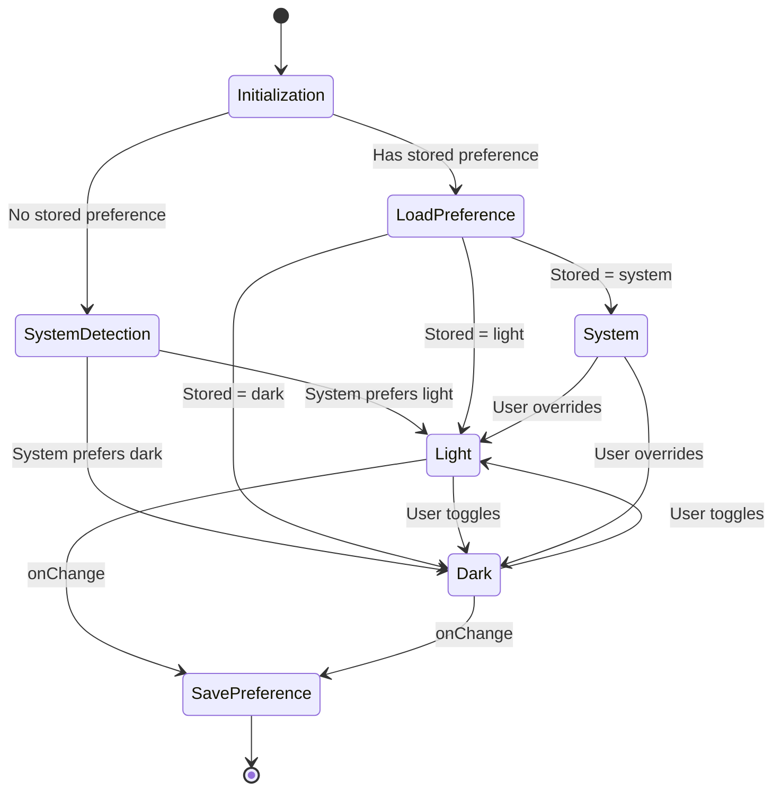
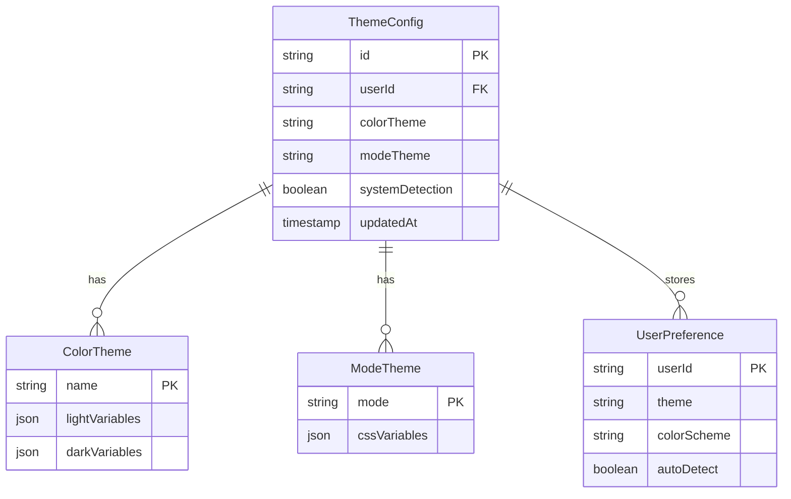

# Product Requirements Document: Dark Mode Implementation for HallowBranch

## Executive Summary

This document outlines the implementation of a comprehensive dark mode feature for the HallowBranch family genealogy platform. The solution will provide users with a toggle between light and dark themes while maintaining the existing color theme system (sass, blue, purple, green). The implementation leverages modern web standards and React 19/Next.js 15 best practices to deliver an accessible, performant, and user-friendly dark mode experience.

## Problem & Solution

### Problem Statement

Users of HallowBranch currently have no option to switch to a dark mode interface, leading to:
- **Eye strain** during extended genealogy research sessions, especially at night
- **Accessibility limitations** for users with light sensitivity or visual impairments
- **Battery drain** on OLED devices when using the bright interface
- **Reduced usability** in low-light environments where family members might collaborate

### Solution Overview

Implement a comprehensive dark mode system that:
- **Seamlessly integrates** with the existing shadcn/ui component library
- **Preserves** the current color theme system (sass, blue, purple, green)
- **Respects** user system preferences while allowing manual override
- **Persists** user preference across sessions
- **Provides** smooth transitions between modes
- **Maintains** AAA accessibility standards for contrast ratios

## User Stories

### Epic: Dark Mode Feature



### Story 1: Theme Toggle Control

**As a** HallowBranch user
**I want** to toggle between light and dark modes
**So that** I can choose the most comfortable viewing experience for my environment

**Acceptance Criteria:**
- [ ] Theme toggle button is visible in the application header
- [ ] Toggle shows current state with appropriate icon (sun/moon)
- [ ] Clicking toggle immediately switches theme without page reload
- [ ] Theme change applies to all UI components instantly
- [ ] Toggle is keyboard accessible (Enter/Space activation)
- [ ] Screen reader announces current theme state

**Technical Notes:**
- Use `next-themes` library with `data-theme` attribute
- Implement with shadcn/ui Button component
- Icons from lucide-react (Sun/Moon)

### Story 2: System Theme Detection

**As a** user with OS-level dark mode preferences
**I want** HallowBranch to automatically detect my system theme
**So that** the app matches my device settings without manual configuration

**Acceptance Criteria:**
- [ ] App detects system theme on initial load
- [ ] Responds to system theme changes in real-time
- [ ] System detection can be overridden by manual selection
- [ ] "System" option available in theme selector
- [ ] Works across all major browsers and operating systems

**Technical Notes:**
- Use `prefers-color-scheme` media query
- Listen to `matchMedia` change events
- Default to system theme for new users

### Story 3: Theme Persistence

**As a** returning user
**I want** my theme preference to persist across sessions
**So that** I don't need to reconfigure it each visit

**Acceptance Criteria:**
- [ ] Theme preference saved on change
- [ ] Preference restored on next visit
- [ ] No flash of incorrect theme on page load
- [ ] Works even with browser storage disabled (fallback to cookies)
- [ ] Syncs across browser tabs

**Technical Notes:**
- Primary storage in cookies for SSR
- Secondary storage in localStorage for client
- Implement hydration-safe loading strategy

### Story 4: Color Theme Compatibility

**As a** user who has selected a color theme (sass/blue/purple/green)
**I want** dark mode to work with my chosen color theme
**So that** I maintain my personalized experience in both light and dark modes

**Acceptance Criteria:**
- [ ] Each color theme has dark mode variants
- [ ] Color theme selection independent of light/dark mode
- [ ] Maintains brand consistency in dark mode
- [ ] Preserves color theme across mode switches
- [ ] All theme combinations tested for accessibility

**Technical Notes:**
- Extend CSS variables for each theme-mode combination
- Maintain separate color and mode state
- Test all 8 combinations (4 colors × 2 modes)

## Technical Architecture

### System Architecture



### Component Hierarchy



### State Flow Diagram



## API Specifications

### Theme Context API

```typescript
interface ThemeContextValue {
  theme: 'light' | 'dark' | 'system';
  systemTheme: 'light' | 'dark';
  resolvedTheme: 'light' | 'dark';
  setTheme: (theme: 'light' | 'dark' | 'system') => void;
  colorTheme: 'sass' | 'blue' | 'purple' | 'green';
  setColorTheme: (theme: ColorTheme) => void;
}
```

### Theme Storage API

```typescript
interface ThemeStorage {
  // Cookie-based storage for SSR
  setThemeCookie(theme: string): void;
  getThemeCookie(): string | undefined;

  // LocalStorage for client persistence
  setThemeLocal(theme: string): void;
  getThemeLocal(): string | undefined;

  // Combined storage strategy
  persistTheme(theme: string): void;
  loadTheme(): string | 'system';
}
```

### CSS Variable API

```css
/* Base theme variables */
[data-theme="light"] {
  --background: 0 0% 100%;
  --foreground: 222.2 84% 4.9%;
}

[data-theme="dark"] {
  --background: 222.2 84% 4.9%;
  --foreground: 210 40% 98%;
}

/* Combined theme classes */
.theme-sass[data-theme="dark"] {
  --color-primary-500: /* dark variant */;
}
```

## Data Models

### Theme Configuration Model



### CSS Variable Structure

```yaml
root_variables:
  light_mode:
    background: "0 0% 100%"
    foreground: "222.2 84% 4.9%"
    primary: "222.2 47.4% 11.2%"
    # ... other variables

  dark_mode:
    background: "222.2 84% 4.9%"
    foreground: "210 40% 98%"
    primary: "210 40% 98%"
    # ... other variables

theme_overrides:
  sass_dark:
    primary_50: "adjusted_value"
    primary_500: "adjusted_value"
    # ... theme-specific dark values
```

## Implementation Phases

### Phase 1: Core Infrastructure (MVP)

```mermaid
gantt
    title Phase 1: Core Infrastructure
    dateFormat X
    axisFormat %s

    section Setup
    Install Dependencies          :done, s1, 0, 1
    Create ThemeProvider          :done, s2, after s1, 2
    Setup CSS Variables           :done, s3, after s2, 2

    section Integration
    Wrap Root Layout              :active, i1, after s3, 1
    Create Toggle Component       :active, i2, after i1, 2
    Add to Header                 :i3, after i2, 1

    section Testing
    Test Light/Dark Toggle        :t1, after i3, 1
    Verify No FOUC               :t2, after t1, 1
    Check Persistence            :t3, after t2, 1
```



**Deliverables:**
- `next-themes` integrated with Next.js 15
- ThemeProvider wrapping application
- Basic theme toggle in header
- CSS variables for light/dark modes
- No flash of unstyled content (FOUC)

### Phase 2: System Integration

**Deliverables:**
- System theme detection
- Real-time system theme monitoring
- Cookie-based persistence for SSR
- LocalStorage fallback
- Cross-tab synchronization

### Phase 3: Color Theme Compatibility

**Deliverables:**
- Dark variants for all color themes
- Combined theme system (color + mode)
- Smooth transitions between combinations
- Accessibility testing for all variants

### Phase 4: Polish & Enhancement

**Deliverables:**
- Advanced transition animations
- Theme preview before applying
- Keyboard shortcuts for toggle
- User preference in database (optional)
- Analytics for theme usage

## Risks & Mitigations

### Technical Risks

| Risk | Impact | Probability | Mitigation |
|------|--------|-------------|------------|
| **Hydration Mismatch** | High | Medium | Use `suppressHydrationWarning` and `data-theme` attribute |
| **FOUC on Load** | High | High | Inline critical theme detection script in `<head>` |
| **CSS Variable Conflicts** | Medium | Low | Namespace variables properly, test all combinations |
| **Browser Incompatibility** | Low | Low | Provide fallbacks for older browsers |
| **Performance Degradation** | Medium | Low | Use CSS variables instead of runtime styling |

### User Experience Risks

| Risk | Impact | Probability | Mitigation |
|------|--------|-------------|------------|
| **Accessibility Issues** | High | Medium | Maintain AAA contrast ratios, test with screen readers |
| **Theme Confusion** | Low | Low | Clear visual indicators, smooth transitions |
| **Lost Preferences** | Medium | Low | Multiple storage mechanisms (cookie + localStorage) |

## Success Metrics

### Quantitative Metrics

- **Adoption Rate**: >40% of users try dark mode within first week
- **Retention**: >25% of users keep dark mode as default
- **Performance**: <10ms theme switch time
- **Zero FOUC**: 100% of page loads without flash
- **Accessibility**: 100% AAA contrast compliance

### Qualitative Metrics

- **User Satisfaction**: Positive feedback on implementation
- **Developer Experience**: Easy to maintain and extend
- **Design Consistency**: Maintains brand identity in dark mode
- **Cross-Platform**: Works identically across all devices

### Testing Metrics

- **Coverage**: 100% of components support dark mode
- **Combinations**: All 8 theme combinations tested
- **Browsers**: Tested on Chrome, Firefox, Safari, Edge
- **Devices**: Desktop, tablet, mobile verified
- **Accessibility**: WCAG AAA compliance verified

## Appendices

### Appendix A: Browser Support Matrix

| Browser | Version | Support Level |
|---------|---------|---------------|
| Chrome | 90+ | Full |
| Firefox | 88+ | Full |
| Safari | 14+ | Full |
| Edge | 90+ | Full |
| Mobile Chrome | Latest | Full |
| Mobile Safari | 14+ | Full |

### Appendix B: Color Contrast Ratios

```yaml
light_mode:
  text_on_background: 15.3:1 (AAA)
  primary_on_white: 8.2:1 (AAA)
  secondary_on_white: 7.5:1 (AAA)

dark_mode:
  text_on_background: 14.8:1 (AAA)
  primary_on_dark: 8.5:1 (AAA)
  secondary_on_dark: 7.2:1 (AAA)
```

### Appendix C: Performance Benchmarks

```yaml
metrics:
  theme_switch_time: <10ms
  css_variable_update: <5ms
  storage_write: <2ms
  render_update: <16ms (one frame)
  total_operation: <33ms
```

### Appendix D: Implementation Checklist

- [ ] Install `next-themes` package
- [ ] Create ThemeProvider component
- [ ] Wrap root layout with provider
- [ ] Add `suppressHydrationWarning` to HTML element
- [ ] Create theme toggle component
- [ ] Add toggle to application header
- [ ] Define CSS variables for dark mode
- [ ] Create dark variants for each color theme
- [ ] Implement cookie persistence
- [ ] Add localStorage fallback
- [ ] Test all theme combinations
- [ ] Verify accessibility compliance
- [ ] Add keyboard shortcuts
- [ ] Document theme system
- [ ] Monitor adoption metrics

---

## Implementation Notes

This PRD provides a complete blueprint for implementing dark mode in HallowBranch. The solution balances modern best practices with the specific requirements of the existing codebase, ensuring a smooth integration that enhances user experience without disrupting current functionality.

The phased approach allows for iterative development and testing, with the MVP delivering immediate value while subsequent phases add polish and advanced features. All technical decisions are grounded in 2025 web development best practices, with particular attention to React 19's new capabilities and Next.js 15's server component architecture.