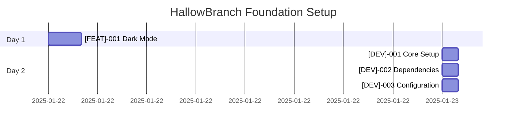

# Task Tracker - HallowBranch Genealogy Platform

## Executive Summary

This tracker manages the development of HallowBranch, a private family genealogy platform built with Next.js 15, React 19, TypeScript, and Supabase. The tasks are organized by category and phase, providing clear visibility into progress, dependencies, and the critical path to delivering a secure, privacy-focused genealogy application.

## Current Status Overview

### Phase Progress

| Phase             | Completion | Status     |
| ----------------- | ---------- | ---------- |
| Foundation Setup  | 0%         | 🔄 Active  |
| Core Features     | 0%         | ⏸️ Planned |
| Advanced Features | 0%         | ⏸️ Planned |

### Quick Metrics

- **Critical Path Duration**: ~2 hours (foundation tasks)
- **Total Effort Required**: ~2 hours
- **Target Completion**: 2025-01-22
- **Blockers**: None currently

## Phase 1: Foundation Setup Tasks

### Critical Path (P0)

| Task ID                         | Title              | Priority | Duration | Dependencies | Status   |
| ------------------------------- | ------------------ | -------- | -------- | ------------ | -------- |
| [[DEV]-001](dev/[DEV]-001-*.md) | <Brief task title> | P0       | Xh       | None         | 🔄 Ready |
| [[DEV]-002](dev/[DEV]-002-*.md) | <Brief task title> | P0       | Xh       | None         | 🔄 Ready |
| [[DEV]-003](dev/[DEV]-003-*.md) | <Brief task title> | P0       | Xh       | None         | 🔄 Ready |

### Important Features (P1)

| Task ID                                                  | Title            | Priority | Duration | Dependencies | Status   |
| -------------------------------------------------------- | ---------------- | -------- | -------- | ------------ | -------- |
| [[FEAT]-001](features/[FEAT]-001-implement-dark-mode.md) | Dark Mode Toggle | P2       | 2h       | None         | 🔄 Ready |

### Optimization (P2)

| Task ID                            | Title              | Priority | Duration | Dependencies | Status   |
| ---------------------------------- | ------------------ | -------- | -------- | ------------ | -------- |
| [[PERF]-001](perf/[PERF]-001-*.md) | <Brief task title> | P2       | Xh       | None         | 🔄 Ready |

**Phase 1 Total**: ~2 hours

## Phase 2: [Phase 2 Name] Tasks

| Task ID                                      | Title              | Priority | Duration | Dependencies | Status     |
| -------------------------------------------- | ------------------ | -------- | -------- | ------------ | ---------- |
| [[PREFIX]-007]([category]/[PREFIX]-007-*.md) | <Brief task title> | P1       | Xh       | [PREFIX]-003 | ⏸️ Blocked |
| [[PREFIX]-008]([category]/[PREFIX]-008-*.md) | <Brief task title> | P1       | Xh       | [PREFIX]-007 | ⏸️ Blocked |
| [[PREFIX]-009]([category]/[PREFIX]-009-*.md) | <Brief task title> | P1       | Xh       | [PREFIX]-007 | ⏸️ Blocked |

**Phase 2 Total**: ~X hours

## Task Dependencies

```mermaid
graph LR
    A[[PREFIX]-001: Task A] --> D[[PREFIX]-005: Task D]
    B[[PREFIX]-002: Task B] --> E[[PREFIX]-004: Task E]
    C[[PREFIX]-003: Task C] --> F[[PREFIX]-007: Task F]
    D --> G[[PREFIX]-006: Task G]
    C --> D
    E --> D

    style A fill:#f9f,stroke:#333,stroke-width:2px
    style B fill:#f9f,stroke:#333,stroke-width:2px
    style C fill:#f9f,stroke:#333,stroke-width:2px
```

## Execution Timeline



## Critical Path

The minimum time to completion follows this sequence:

1. **Foundation Setup** (Day 1):

   - [FEAT]-001: Implement dark mode toggle for enhanced user experience

2. **Core Development Setup** (Day 2):

   - [DEV]-001: Set up development environment and tooling
   - [DEV]-002: Install and configure dependencies
   - [DEV]-003: Configure build system and development workflow

**Critical Path Duration**: ~2 hours for foundation functionality

## Risk Register

| Risk               | Probability | Impact | Mitigation            |
| ------------------ | ----------- | ------ | --------------------- |
| <Risk description> | Medium      | High   | <Mitigation strategy> |
| <Risk description> | Low         | Medium | <Mitigation strategy> |
| <Risk description> | Low         | Low    | <Mitigation strategy> |

## Success Criteria

- [ ] **Dark Mode Implementation**: Theme toggle works and persists user preference
- [ ] **Build Success**: Project builds without errors after implementation
- [ ] **No Breaking Changes**: Existing functionality remains unaffected
- [ ] **Accessibility**: Toggle is keyboard accessible and screen reader friendly
- [ ] **Performance**: Theme switching has smooth transitions without lag

## Quick Commands

### Development Workflow

```bash
# HallowBranch Development Commands
cd nextjs
npm run dev          # Start development server
npm run build        # Build for production
npm run lint         # Check code quality
npm run type-check   # Check TypeScript types

# Database and Authentication
cd ../supabase
supabase start       # Start local Supabase instance
supabase status      # Check Supabase status
```

## Notes

- Tasks marked 🔄 Ready can be started immediately
- Update task status immediately when starting/completing work
- Update this INDEX.md when adding/removing tasks
- Archive completed phases to `completed/` subdirectory

## References

- [Project Documentation](../../README.md)
- [Architecture Decisions](../../decisions/)
- [Technical Guides](../../docs/)
- [API Documentation](../../api/)

---

_Use [README.md](README.md) for task system documentation_
_Individual task details in respective task files_
